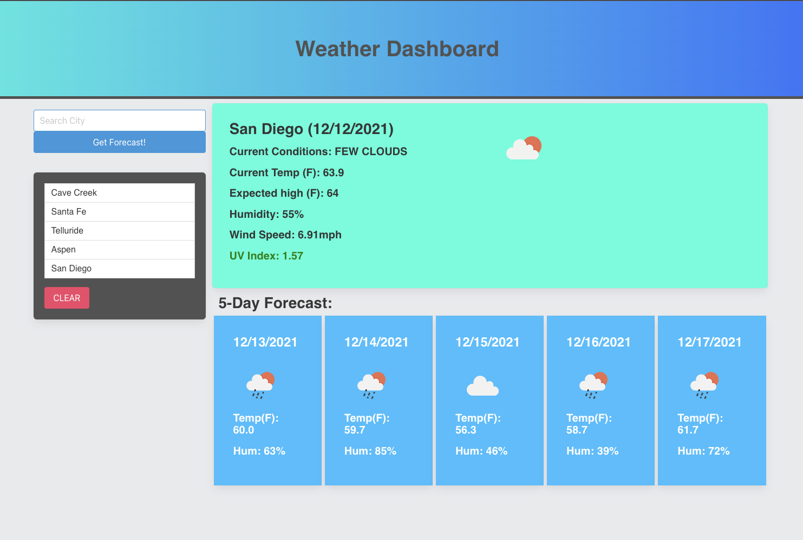

# weather-dashboard

This week’s Challenge is to create a simple application for checking the current weather and 5-day forecast for any city.

## Links
* Live Site: https://joshualintz.github.io/weather-dashboard/
* Code Repo: https://github.com/joshualintz/weather-dashboard

## Built With
* HTML
* [Bulma CSS](https://bulma.io/)
* [jQuery](https://jquery.com/)
* [JavaScript](https://www.javascript.com/)
* [OpenWeather API](https://openweathermap.org/api/one-call-api)
* [moment.js](https://momentjs.com/)

## User Story

AS A traveler
I WANT to see the weather outlook for multiple cities
SO THAT I can plan a trip accordingly

## Acceptance Criteria

GIVEN a weather dashboard with form inputs

1. WHEN I search for a city, THEN I am presented with current and future conditions for that city and that city is added to the search history
2. WHEN I view current weather conditions for that city, THEN I am presented with the city name, the date, an icon representation of weather conditions, the temperature, the humidity, the wind speed, and the UV index
3. WHEN I view the UV index, THEN I am presented with a color that indicates whether the conditions are favorable, moderate, or severe
4. WHEN I view future weather conditions for that city, THEN I am presented with a 5-day forecast that displays the date, an icon representation of weather conditions, the temperature, the wind speed, and the humidity
5. WHEN I click on a city in the search history, THEN I am again presented with current and f

## Grading Requirements

This challenge is graded based on the following criteria:

* Technical Acceptance Criteria: 40%
    * Satisfies all of the above acceptance criteria plus the following:
        * Uses the [OpenWeather API](https://openweathermap.org/api/one-call-api) to retrieve weather data
        * Uses localStorage to store persistent data
* Deployment: 32%
    * Application deployed at live URL.
    * Application loads with no errors.
    * Application GitHub URL submitted.
    * GitHub repository that contains application code.
* Application Quality: 15%
    * Application user experience is intuitive and easy to navigate.
    * Application user interface style is clean and polished.
    * Application resembles the mock-up functionality provided in the Challenge instructions.
* Repository Quality: 13%
    * Repository has a unique name.
    * Repository follows best practices for file structure and naming conventions.
    * Repository follows best practices for class/id naming conventions, indentation, quality comments, etc.
    * Repository contains multiple descriptive commit messages.
    * Repository contains quality README file with description, screenshot, and link to deployed application.

## How to Submit the Challenge

You are required to submit BOTH of the following:
* The URL of the deployed application.
* The URL of the GitHub repository. Give the repository a unique name and include a README describing the project.